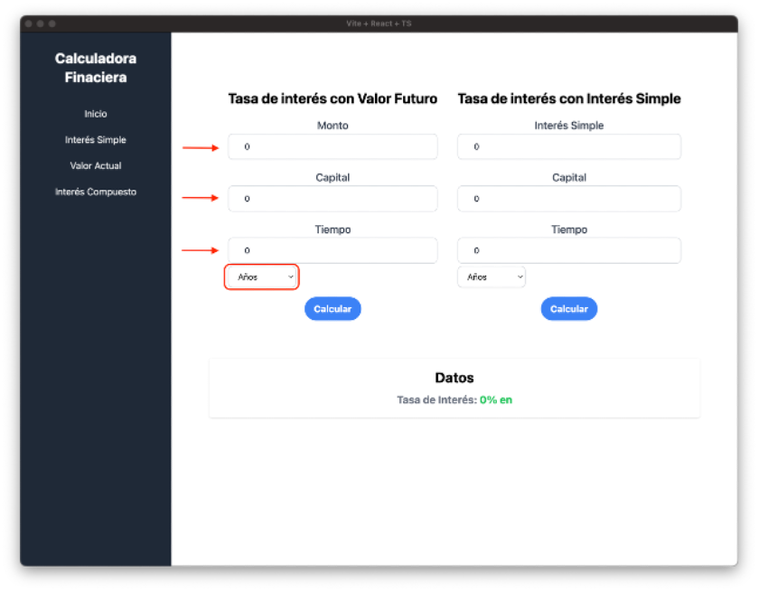

# React + TypeScript + Vite

This template provides a minimal setup to get React working in Vite with HMR and some ESLint rules.

Currently, two official plugins are available:

- [@vitejs/plugin-react](https://github.com/vitejs/vite-plugin-react/blob/main/packages/plugin-react/README.md) uses [Babel](https://babeljs.io/) for Fast Refresh
- [@vitejs/plugin-react-swc](https://github.com/vitejs/vite-plugin-react-swc) uses [SWC](https://swc.rs/) for Fast Refresh

## Expanding the ESLint configuration

If you are developing a production application, we recommend updating the configuration to enable type aware lint rules:

- Configure the top-level `parserOptions` property like this:

```js
export default {
  // other rules...
  parserOptions: {
    ecmaVersion: "latest",
    sourceType: "module",
    project: ["./tsconfig.json", "./tsconfig.node.json"],
    tsconfigRootDir: __dirname,
  },
};
```

- Replace `plugin:@typescript-eslint/recommended` to `plugin:@typescript-eslint/recommended-type-checked` or `plugin:@typescript-eslint/strict-type-checked`
- Optionally add `plugin:@typescript-eslint/stylistic-type-checked`
- Install [eslint-plugin-react](https://github.com/jsx-eslint/eslint-plugin-react) and add `plugin:react/recommended` & `plugin:react/jsx-runtime` to the `extends` list

### Calculadora Financiera

1. Introducción

Bienvenido al manual de usuario de la Calculadora Financiera. Esta aplicación está diseñada para ser utilizada por entidades bancarias, específicamente por agentes que necesitan recopilar y procesar datos durante las visitas de los clientes al banco. La app incluye tres calculadoras principales: interés simple, valor presente e interés compuesto. Además, en la ventana de “Inicio” se encuentran dos calculadoras adicionales para calcular la tasa de interés basada en el valor futuro (monto) o el interés simple, dependiendo de los datos disponibles.

La aplicación está diseñada para dispositivos de escritorio, incluyendo computadoras personales y laptops, y se ha desarrollado utilizando el framework Electron JS. Electron JS permite construir aplicaciones nativas para Windows, macOS y Linux utilizando JavaScript, HTML y CSS, integrando Chromium y NodeJS en sus binarios. Para la estilización y funcionalidad de la app, se ha utilizado el paquete de Vite + React + TypeScript, lo que asegura un desarrollo más rápido, limpio y eficiente.

2. Requisitos de Sistema

Los requisitos para ejecutar este proyecto no son tan altos gracias al uso de React y TypeScript. Aunque Electron JS puede ser demandante, no representa un mayor problema ya que la aplicación no ejecuta tareas intensivas:

• Sistema Operativo: Windows 8.1 o superior, macOS Mojave o superior, Linux: Ubuntu 16.04 o superior, CentOS 7 o superior
• Memoria RAM: 3GB o mas
• Espacio en disco: al menos 800 GB libres

3. Instalación

Actualmente, la aplicación no está empaquetada para producción. Sin embargo, aquí están las indicaciones para instalarla una vez que esté en ese estado:

1. Obtener el instalador:
   o Descarga el instalador de la aplicación desde un sitio web, tienda virtual o repositorio.
2. Ejecutar el instalador o descomprimir el archivo ZIP:
   o Si descargaste un instalador, ejecútalo.
   o Si descargaste un archivo ZIP desde un repositorio, descomprímelo.
3. Iniciar la aplicación:
   o Una vez instalada, abre la aplicación desde el ícono en la ubicación donde se haya almacenado.
   o Si descargaste desde un repositorio, entra a la carpeta del proyecto en una terminal y ejecuta npm run dev. Para esto, asegúrate de tener Node.js instalado y de haber instalado las dependencias del proyecto previamente.

4. Descripción de la Interfaz de Usuario

La interfaz de usuario fue diseñada para ser moderna, minimalista y fácil de usar, lo que motivó la elección de las tecnologías tanto para el Frontend como para el Backend.
Para el desarrollo del Frontend, se utilizó el paquete Vite + React + TypeScript, lo que permitió crear componentes reutilizables de manera fácil, rápida y efectiva. La rapidez y la efectividad fueron las razones principales para optar por TypeScript y React, que facilitan la creación de componentes. Para la estilización, se empleó TailwindCSS, lo que permitió aplicar efectos visuales sin tener que escribir CSS por separado, lo que agiliza el desarrollo y mantiene el código limpio. La elección de Vite se debió a su capacidad para acelerar la creación del proyecto y permitir un desarrollo más ágil, creando el proyecto de una sola vez sin necesidad de configurar directorios separados para el Backend y el Frontend. Con estas tecnologías, logramos una interfaz de usuario sencilla y atractiva para la calculadora financiera.

5. Guia de Uso

Al comienzo de iniciar nuestra app nos encontraremos con una sidenav y una pantalla en blanco para dirigirnos a las diferentes calculadoras solo debemos presionar los botones que ya tienen definidas sus rutas a los componentes:

a. Inicio

En este componente encontraremos dos calculadoras con el mismo fin, encontrar la tasa de interes ya sea con el valor futuro o con el interes simple:

i. Tasa de interes con Valor Futuro

Es muy sencillo, unicamente colocamos nuestros datos en cada espacio e importante seleccionar el tiempo para asi determinar correctamente nuestra tasa de interes:



Y por ultimo solo damos click en calcular y obtendremos nuestro resultado:


ii. Tasa de interes con Interes Simple

Colocamos nuestros datos en cada espacio e importante seleccionar el tiempo para asi determinar correctamente nuestra tasa de interes:


Y por ultimo solo damos click en calcular y obtendremos nuestro resultado:


b. Interes Simple

Unicamente debemos llenar los campos y selccionar nuestro tiempo y presionamos Calcular para obtener nuestro calculo:


Cabe mencionar que en todos los calculos hay que ingresar nuestro porcentaje en decimales.

c. Valor Actual

Con el Valor Actual es igual llenamos nuestros datos y seleccionamos el tiempo de nuestro interes y periodos y luego clickeamos el boton Calcular.


i. Simple


Sin Embargo al observar vemos que hay dos cosas nuevas el primero es el tipo de interes, que este es para poder calcular el valor actual en interes simple o compuesto. Y el segundo es el componente para calcular el tiempo si no se tiene, usando los valores de monto, interes e interes simple que aprecera al quitar el check del checkbox:


ii. Compuesto


Sin Embargo al observar vemos que hay dos cosas nuevas el primero es el tipo de interes, que este es para poder calcular el valor actual en interes simple o compuesto. Y el segundo es el componente para calcular el tiempo si no se tiene, usando los valores de monto, interes e interes simple que aprecera al quitar el check del checkbox:


d. Interes Compuesto

Para el interes compuesto, igual que el simple solo debemos agregar nuestro datos y clickear el boton Calcular para obtner nuestro resultado:


6. Resolución de Problemas comunes

Hasta el momento por la simplicidad de la aplicación no tiene errores, sin embargo hay dos cosas a mencionar, la primera es que siempre se debe agregar el interes en decimales, unicamente aparece en entero con porcentaje en la respuesta ya que es convertido para que sea mostrada, la segunda, es que en la ventana de “Valor Actual” hay un ligero margen de error porcentual en la respuesta, aun la formula para ello este correcta.

7. Contacto y Soporte

Para contacto y soporte por favor no dudes en contactarme personalmente, estare feliz de ayudarte o colaborar!

Correo: johep07@gmail.com
LinkedIn: Johep Gradis
Github: Johepdgc
